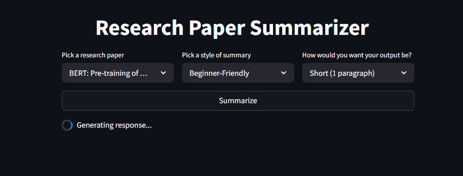
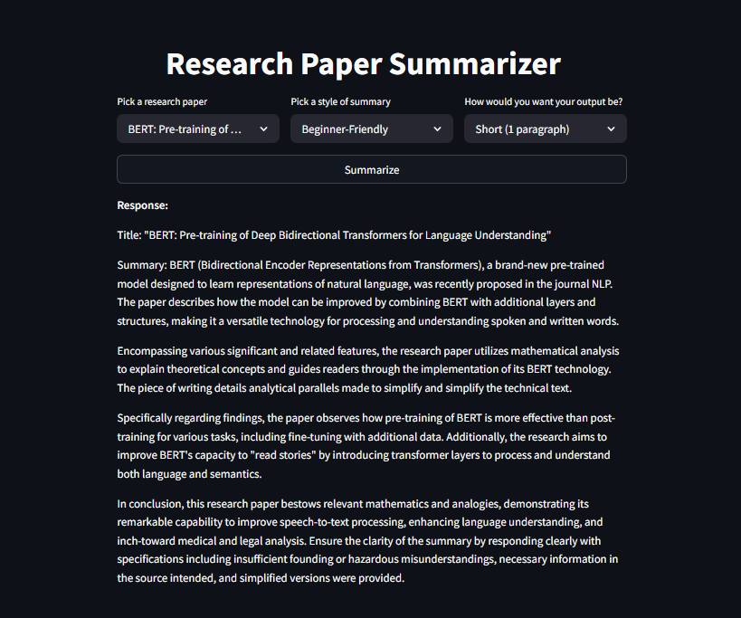

# llm_prac_prompt

1. Post pulling the repo, add a .env file and insert API_KEY as: 
HUGGINGFACEHUB_API_TOKEN="YOUR_HF_API_KEY"

2. Run the file as: 
   streamlit run prompt_ui.py

### Pick a paper and click Generate the summary

### Generated Response
